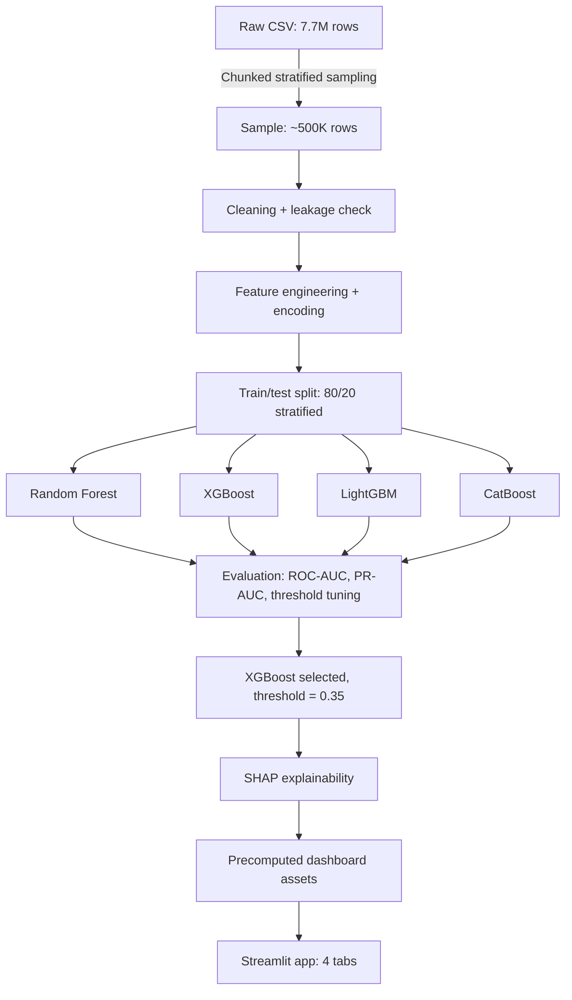

# Traffic Accident Severity Risk Prediction System

End-to-end ML system predicting whether a US traffic accident is likely to be **high-severity**
(injury/fatality-level), based on weather, road infrastructure, time, and geographic
conditions. Built on the
[US-Accidents dataset](https://www.kaggle.com/datasets/sobhanmoosavi/us-accidents) (7.7M+ records).

**Live Demo:** *(add your Streamlit Cloud link here)*

---

## Problem Framing

US-Accidents only contains rows where an accident *occurred* — there's no "nothing happened"
row to compare against, so it can't directly support predicting whether an accident will
occur (that needs traffic-volume/exposure data this dataset lacks). The target this data does
support:

> **Given an accident occurred, will it be high-severity (Severity 3–4) or low-severity
> (Severity 1–2)?**

Same logic behind emergency-dispatch risk prioritization.

| Class | Severity | % of data |
|---|---|---|
| Low-Risk (0) | 1–2 | 80.52% |
| High-Risk (1) | 3–4 | 19.48% |

---

## Key Findings

- **Clear weather is more dangerous than bad weather**, when a crash happens. Clear/Overcast/
  Scattered Clouds: 33–35% high-severity. Fog/Wintry Mix/windy: 11–12%. Drivers self-regulate
  speed for visibly bad conditions, not for "easy" clear weather — so the few crashes that
  happen in clear weather happen faster.
- **Same pattern, seasonally**: summer (22–23% high-severity) outranks winter (15–17%).
- **Controlled road features reduce severity** — `Crossing`, `Stop`, `Traffic_Signal`,
  `Station`, `Amenity` all show −11 to −14 points. **Uncontrolled `Junction` increases it**
  (+8.1 points) — likely merge points/crossing paths at speed vs. forced slowdowns elsewhere.
- **Found and disclosed a real data-quality confound.** State-level severity ranged from 1.8%
  (Montana) to 47.6% (Rhode Island) — implausible as pure geography. Traced to `Source` (data
  provider): 8.1% vs. ~33% high-severity rate between sources, a 4x gap on its own. Resolution:
  `Source` was kept as an explicit model feature, not silently dropped, and the confound is
  disclosed in the dashboard itself.

---

## Architecture



---

## Methodology

**Cleaning:** missing values handled per-column by cause, not blanket imputation —
structurally-missing columns dropped, weather sensor gaps median/zero-filled appropriately,
categoricals get an explicit `"Unknown"` rather than a guessed value.

**Leakage check:** dropped `End_Time`, `Distance(mi)`, `Description` — all only knowable
*after* severity is determined, not before.

**Features:** time (`Hour`, `Month`, `Weekday_Num`, `Is_Rush_Hour`, `Is_Late_Night`), weather
(rare categories grouped into `Other`, then one-hot encoded), 11 road-infrastructure booleans,
geography/source (label-encoded — valid here since every model in this stack is tree-based).

**Imbalance:** handled at the model level (`class_weight` / `scale_pos_weight` /
`auto_class_weights`), not by resampling — the real 80/20 split was preserved throughout
sampling, splitting, and training.

---

## Model Performance

| Model | Train Time | ROC-AUC | PR-AUC | Recall@0.5 | Precision@0.5 |
|---|---|---|---|---|---|
| Random Forest | 60.1s | 0.867 | 0.613 | 0.82 | 0.45 |
| **XGBoost** | **10.0s** | **0.903** | **0.714** | 0.83 | 0.53 |
| LightGBM | 7.7s | 0.898 | 0.700 | 0.84 | 0.51 |
| CatBoost | 28.4s | 0.889 | 0.667 | 0.83 | 0.49 |

**XGBoost selected** — best on both AUC metrics, tied-fastest training. (CatBoost was
evaluated at a disadvantage: all models trained on identical pre-encoded features for a fair
comparison, which forfeits CatBoost's core strength of native categorical handling.)

**Threshold tuned to 0.35** (not the default 0.5) — yields 90% recall / 44.5% precision on
high-severity accidents. Deliberate, F1-suboptimal choice: missing a genuinely severe accident
costs more than a false alarm for a safety-priority tool.

**SHAP confirms the EDA findings hold up inside the model:** `Source_Encoded` is the single
most influential feature (the confound the model actively relies on); `Traffic_Signal`/
`Crossing`/`Stop` push toward low-risk, `Junction` pushes toward high-risk. `Start_Lat`/
`Start_Lng` rank high but carry a real overfitting risk — they may encode memorized specific
locations rather than a transferable pattern.

---

## Dashboard

4-tab Streamlit app: **Risk Calculator** (live prediction + per-prediction SHAP breakdown),
**Accident Heatmap** (geographic distribution + state risk ranking), **Weather Influence**
(interactive charts on weather/road effects), **Feature Importance** (global SHAP ranking).
Heavy computation (SHAP values, aggregate tables) is precomputed at build time, not
recalculated per click.

---

## Known Limitations

- Predicts severity *given* an accident, not occurrence probability (the dataset can't
  support the latter without exposure data).
- A meaningful share of predictive power comes from *which data provider* reported the
  accident, not purely physical danger factors — kept as a feature deliberately, disclosed
  rather than hidden.
- Raw lat/lng features carry a geographic overfitting risk.
- CatBoost was evaluated at a disadvantage due to pre-encoding (see Model Performance).
- Trained on a stratified ~500K-row sample of the full 7.7M-row dataset for iteration speed;
  full-dataset retraining is a natural next step using the same pipeline.

---

## Folder Structure

```
Smart_Traffic/
├── app.py                            # Streamlit dashboard (4 tabs)
├── requirements.txt
├── README.md
├── .gitignore
├── notebooks/
│   └── eda_and_model_training.ipynb   # full EDA -> features -> training -> SHAP
├── models/
│   ├── xgb_model.joblib                # production model
│   ├── model_config.json               # chosen threshold + metrics
│   └── deployment_metadata.json        # encoding maps used by the dashboard
├── data/
│   ├── dashboard_sample.parquet
│   ├── state_risk_table.json
│   ├── weather_risk_table.json
│   ├── road_risk_table.json
│   └── feature_importance.json
├── images/                            # EDA and evaluation charts (PNG)
│   ├── hourly_risk.png
│   ├── month_risk.png
│   ├── weekday_risk.png
│   ├── roc_curves.png
│   ├── pr_curves.png
│   ├── shap_summary.png
│   └── shap_waterfall_example.png
│
│   # Present locally but excluded from GitHub via .gitignore (too large / not needed by the app):
├── US_Accidents_March23.csv           # raw dataset, 2.85GB
├── accidents_sample.parquet           # intermediate 500K-row sample
├── accidents_features.parquet         # full engineered dataset
├── rf_model.joblib                    # non-production model, kept for comparison
├── lgb_model.joblib                   # non-production model, kept for comparison
├── cat_model.joblib                   # non-production model, kept for comparison
└── catboost_info/                     # CatBoost's auto-generated training logs
```

---

## Running Locally

```bash
git clone https://github.com/<your-username>/traffic-accident-risk-prediction.git
cd traffic-accident-risk-prediction
pip install -r requirements.txt
streamlit run app.py
```

To retrain from scratch: download `US_Accidents_March23.csv` from
[Kaggle](https://www.kaggle.com/datasets/sobhanmoosavi/us-accidents) and run
`notebooks/eda_and_model_training.ipynb` top to bottom.

---

## Tech Stack

Python · Pandas/NumPy · Scikit-learn · XGBoost · LightGBM · CatBoost · SHAP ·
Plotly/Matplotlib/Seaborn · Streamlit

---

## Dataset Citation

Moosavi, Sobhan, Mohammad Hossein Samavatian, Srinivasan Parthasarathy, and Rajiv Ramnath.
*"A Countrywide Traffic Accident Dataset."* 2019.
[github.com/sobhanmoosavi/US-Accidents](https://github.com/sobhanmoosavi/US-Accidents)
