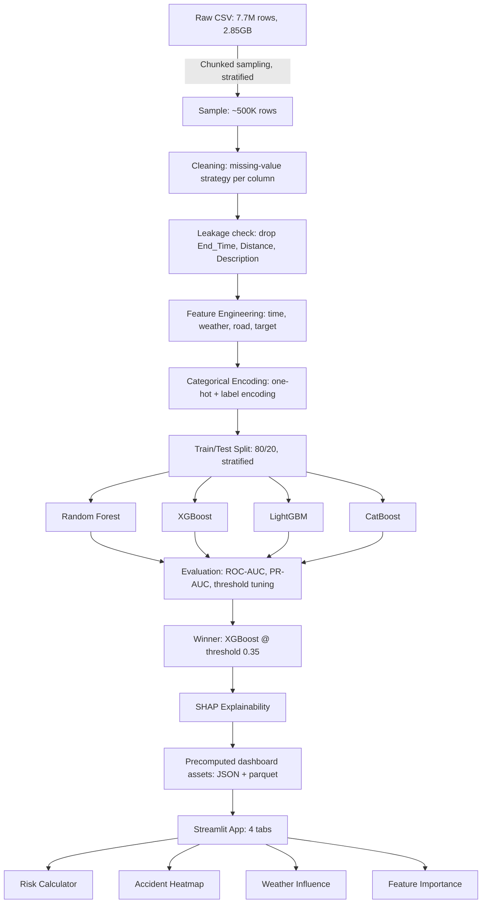

# 🚦 Traffic Accident Severity Risk Prediction System

An end-to-end machine learning system that predicts whether a US traffic accident is likely
to be **high-severity** (injury/fatality-level) based on weather, road infrastructure, time,
and geographic conditions — built on the
[US-Accidents dataset](https://www.kaggle.com/datasets/sobhanmoosavi/us-accidents) (7.7M+ records).

**[Live Demo](#)** *(add your Streamlit Cloud link here after deployment)*

---

## Table of Contents
- [Problem Framing](#problem-framing)
- [Key Findings](#key-findings)
- [Architecture](#architecture)
- [Methodology](#methodology)
- [Model Performance](#model-performance)
- [Dashboard](#dashboard)
- [Known Limitations](#known-limitations)
- [Folder Structure](#folder-structure)
- [Running Locally](#running-locally)
- [Tech Stack](#tech-stack)

---

## Problem Framing

The raw US-Accidents dataset contains **only rows where an accident occurred** — there is no
"nothing happened" row to contrast against. This means the data does not directly support
predicting *whether* an accident will occur (that requires traffic-volume/exposure data this
dataset doesn't have). Instead, this project predicts a well-posed, genuinely supported target:

> **Given that an accident has occurred, will it be high-severity (Severity 3–4) or
> low-severity (Severity 1–2)?**

This reframing is deliberate and disclosed upfront rather than glossed over — it's the
difference between a model that's technically accurate and one that's honestly described.
The resulting binary target (`Risk_Target`) has real operational value: this is the same kind
of risk-scoring logic used in emergency-dispatch prioritization.

| Class | Severity | % of data |
|---|---|---|
| Low-Risk (0) | 1–2 | 80.52% |
| High-Risk (1) | 3–4 | 19.48% |

---

## Key Findings

EDA on a stratified 500,000-row sample (drawn via chunked sampling from the full 7.7M-row file)
surfaced several non-obvious patterns:

**1. Clear weather is more dangerous than bad weather, when an accident happens.**
Clear (33.8%), Overcast (34.8%), and Scattered Clouds (35.1%) show the *highest* severity
rates; Fog (12.4%), Wintry Mix (11.2%), and windy conditions show the *lowest*. The likely
mechanism: drivers self-regulate speed when conditions visibly demand caution (snow, fog) but
not in "easy" clear weather — so the few accidents that do happen in clear conditions happen
at higher, more dangerous speeds.

**2. The same pattern repeats seasonally.** Summer months (Jun–Aug, 22.7–23.4% high-severity)
are more dangerous than winter (Dec–Jan, 15.5–17.0%) — the opposite of the ice/snow intuition,
for the same self-regulation reason.

**3. Uncontrolled junctions are uniquely dangerous; controlled features are protective.**
`Crossing`, `Stop`, `Traffic_Signal`, `Station`, and `Amenity` all reduce severity by
11–14 percentage points when present (forced slowdowns). `Junction` is the one exception,
*increasing* severity by 8.1 points — likely uncontrolled intersections and merge points
where vehicles cross paths at speed.

**4. A significant data-quality confound was found and addressed, not hidden.**
Raw state-level severity rates range from 1.8% (Montana) to 47.6% (Rhode Island) — a 26x
spread implausible as pure geography. Investigation traced much of this to the `Source`
column (which data provider reported the accident): Source1 reports 8.1% high-severity vs.
~33% for Source2/Source3, a 4x gap on its own. Montana is 99.7% Source1; that "safety" is
likely partly a labeling artifact, not safer roads. **Resolution:** `Source` is kept as an
explicit model feature (so the model can separate provider bias from real signal) rather than
silently dropped or used to "correct" the data — and this is disclosed in the dashboard itself,
not just this README.

---

## Architecture



---

## Methodology

### Data Cleaning
Missing values were handled per-column based on *why* they were missing, not blanket
imputation:
- `End_Lat`/`End_Lng` (44% missing), `Wind_Chill(F)` (26%, derivable from Temp+Wind): dropped
- `Precipitation(in)` (28.5% missing): filled with 0 (missing = no precipitation, not unknown)
- Numeric weather sensor gaps (<8%): median imputation
- Categorical weather gaps: filled with explicit `"Unknown"` category, never silently guessed
- Redundant twilight columns, zero/near-zero-variance booleans (`Turning_Loop`, `Roundabout`),
  and the `ID` identifier column: dropped

### Leakage Prevention
Three columns were excluded specifically because they're only knowable *after* severity is
determined, not before:
- `End_Time` — only known once the incident clears
- `Distance(mi)` — a consequence of severity (more severe → more road blocked), not a cause
- `Description` — free text often describing the outcome itself

### Feature Engineering
- **Time:** `Hour`, `Month`, `Weekday_Num`, `Is_Weekend`, `Is_Rush_Hour`, `Is_Late_Night`
  (rush-hour windows derived from the actual EDA pattern, not textbook assumptions)
- **Weather:** rare categories (<1000 occurrences) grouped into `Other`, then one-hot encoded
- **Road:** 11 boolean infrastructure flags kept as-is (native boolean, tree-model-friendly)
- **Geography/Source:** label-encoded — a deliberate choice valid *because* every model in
  this stack is tree-based (trees split on thresholds, not numeric order); would be wrong for
  linear/distance-based models

### Class Imbalance
Handled at the **model level**, not by resampling the data — `class_weight='balanced'`
(Random Forest), `scale_pos_weight` (XGBoost), `auto_class_weights='Balanced'` (CatBoost).
The 80.52/19.48 split reflects reality and was preserved through sampling, train/test split,
and training; only the *cost of mistakes* was adjusted.

---

## Model Performance

All four models trained on identical pre-encoded features for a fair comparison (note: this
disadvantages CatBoost, whose key strength is native categorical handling — see
[Limitations](#known-limitations)).

| Model | Train Time | ROC-AUC | PR-AUC | Recall@0.5 | Precision@0.5 |
|---|---|---|---|---|---|
| Random Forest | 60.1s | 0.867 | 0.613 | 0.82 | 0.45 |
| **XGBoost** | **10.0s** | **0.903** | **0.714** | 0.83 | 0.53 |
| LightGBM | 7.7s | 0.898 | 0.700 | 0.84 | 0.51 |
| CatBoost | 28.4s | 0.889 | 0.667 | 0.83 | 0.49 |

**XGBoost selected as the production model** — best on both AUC metrics, and tied for
fastest training.

### Threshold Tuning
The default 0.5 cutoff is arbitrary, not chosen for this problem. Threshold was tuned by
comparing precision/recall across a range, then choosing deliberately based on the cost
asymmetry of this use case: **missing a genuinely severe accident (false negative) is more
costly than a false alarm (false positive)** for a safety-priority dispatch tool.

| Threshold | Precision | Recall | F1 |
|---|---|---|---|
| 0.30 | 0.417 | 0.918 | 0.574 |
| **0.35 (chosen)** | **0.445** | **0.900** | **0.596** |
| 0.40 | 0.473 | 0.880 | 0.615 |
| 0.50 (default) | 0.529 | 0.832 | 0.647 |
| 0.644 (F1-optimal) | 0.617 | 0.732 | 0.670 |

**Final choice: 0.35** — catches 90% of genuinely high-severity accidents, accepting a higher
false-alarm rate as the right trade-off for this use case. This was a deliberate F1-suboptimal
choice, not an oversight.

### SHAP Insights
- `Source_Encoded` is the single most influential feature overall — confirming the confound
  found in EDA is something the model actively relies on
- `Traffic_Signal`, `Crossing`, `Stop` consistently push predictions toward low-risk;
  `Junction` consistently pushes toward high-risk — both matching the manual EDA findings
- `Start_Lat`/`Start_Lng` rank highly but carry a real overfitting risk: raw coordinates let
  tree models split on very specific locations, which may not generalize to new locations
  outside the training data

---

## Dashboard

A 4-tab Streamlit application:

1. **🎯 Risk Calculator** — live prediction from user-specified scenario inputs, with a
   per-prediction SHAP breakdown showing exactly which factors increased/decreased that
   specific prediction. Includes an explicit, captioned `Source` dropdown — turning a model
   confound into a transparency feature rather than hiding it.
2. **🗺️ Accident Heatmap** — geographic distribution (20K-point sample) plus state-by-state
   risk ranking, with the Source-bias caveat displayed directly in the UI.
3. **🌦️ Weather Influence** — interactive Plotly charts of weather-condition and
   road-feature effects on severity, with the counter-intuitive findings called out.
4. **📊 Feature Importance** — global SHAP ranking, with the `Source_Encoded` dominance
   flagged rather than presented as a neutral result.

All heavy computation (SHAP values, aggregate tables) is precomputed and cached at build time,
not recalculated on every user interaction — the app reads small JSON/parquet files for
near-instant load times.

---

## Known Limitations

This section exists because a model is only as trustworthy as its documented blind spots.

- **Target reframing:** this predicts severity-given-an-accident, not accident occurrence
  probability. The dataset structurally cannot support the latter without exposure data.
- **Source/provider confound:** a meaningful share of predictive power comes from *which
  data provider* reported the accident, not purely physical danger factors. Included as a
  feature deliberately, disclosed in the dashboard, not papered over.
- **Geographic overfitting risk:** raw lat/lng features may encode memorized specific
  locations rather than a transferable "what makes places risky" pattern.
- **CatBoost evaluated at a disadvantage:** all models were trained on identical pre-encoded
  features for fair comparison, which forfeits CatBoost's core strength (native categorical
  handling). A CatBoost-only pipeline with raw categoricals might outperform this result.
- **Sample-based development:** models were trained on a stratified ~500K-row sample of the
  full 7.7M-row dataset for iteration speed; production retraining on the full dataset is a
  natural next step and is supported by the same pipeline.

---

## Folder Structure

```
traffic-accident-risk-prediction/
├── app.py                          # Streamlit dashboard (4 tabs)
├── requirements.txt
├── README.md
├── .gitignore
├── notebooks/
│   └── 01_eda_and_modeling.ipynb    # full EDA -> features -> training -> SHAP
├── models/
│   ├── xgb_model.joblib             # production model
│   ├── model_config.json            # chosen threshold + metrics
│   └── deployment_metadata.json     # encoding maps for the dashboard
├── data/
│   ├── dashboard_sample.parquet     # 20K-row sample for the heatmap
│   ├── state_risk_table.json
│   ├── weather_risk_table.json
│   ├── road_risk_table.json
│   └── feature_importance.json
└── reports/
    └── figures/                     # EDA and evaluation charts (PNG)
```

> Note: the raw CSV (`US_Accidents_March23.csv`, 2.85GB) and the full engineered dataset
> (`accidents_features.parquet`) are **not** included in this repo — see `.gitignore`. They're
> regenerated by running the notebook against a freshly downloaded copy of the Kaggle dataset.

---

## Running Locally

```bash
# 1. Clone the repo
git clone https://github.com/<your-username>/traffic-accident-risk-prediction.git
cd traffic-accident-risk-prediction

# 2. Install dependencies
pip install -r requirements.txt

# 3. Run the dashboard (uses the pre-trained model already in models/)
streamlit run app.py
```

To retrain from scratch: download `US_Accidents_March23.csv` from
[Kaggle](https://www.kaggle.com/datasets/sobhanmoosavi/us-accidents), place it in `data/raw/`,
and run `notebooks/01_eda_and_modeling.ipynb` top to bottom.

---

## Tech Stack

**Language:** Python
**Data:** Pandas, NumPy, PyArrow (parquet)
**Modeling:** Scikit-learn, XGBoost, LightGBM, CatBoost
**Explainability:** SHAP
**Visualization:** Matplotlib, Seaborn, Plotly
**Deployment:** Streamlit

---

## Dataset Citation

Moosavi, Sobhan, Mohammad Hossein Samavatian, Srinivasan Parthasarathy, and Rajiv Ramnath.
*"A Countrywide Traffic Accident Dataset."* 2019.
[github.com/sobhanmoosavi/US-Accidents](https://github.com/sobhanmoosavi/US-Accidents)
